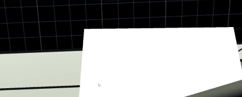

# unity-handwriting
  

## Instructions
- Clone the repo. It's a Unity project with a sample scene.
- The repo includes a version of ML-Agents without examples. If you already have this installed in your own project, you might only want to copy the models, brain, scripts (and optionally prefabs) over.

